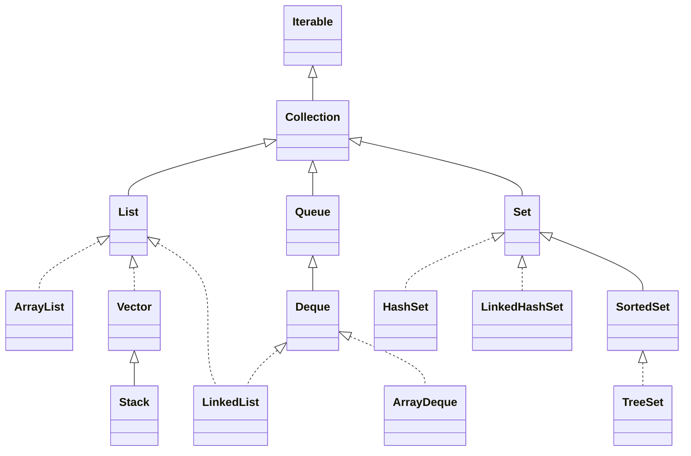

# Collection 接口实现


## List, Queue, Set 
1. List: 有序可重复
2. Set: 无序不可重复
3. Queue: 尾部插入，头部移出

## ArrayList, LinkedList, Vector

| 类别 | ArrayList | Vector | LinkedList |
|:----|:----|:----|:----|
|实现接口|List|List|List, Queue|
|数据结构|数组|数组|双向链表|
|扩容增量|50%|100%或指定容量|不需要扩容|
|优点|适合查找|适合查找|适合插入、删除|
|缺点|不适合插入、删除|不适合插入、删除|不适合查找|
|线程安全|否|是|否|
|适用场景|非并发场景、查找操作比较多|并发场景、查找操作比较多|非并发场景；插入、删除操作比较多|

### SynchronizedList & Vector
在多线程的场景中既可以直接使用Vector类，也可以使用Collections.synchronizedList(List<t> list)方法来返回一个线程安全的List

SynchronizedList是java.util.Collections中的一个静态内部类

<font color=red>SynchronizedList中的listIterator和listIterator(int index)方法并没有做同步处理，所以在使用SynchronizedList进行遍历时，需要开发者手动加锁</font>

建议使用SynchronizedList

### ArrayList的subList

List<E> subList(int fromIndex, int toIndex)

subList方法得到的结果是不能转换成ArrayList、Vector、LinkedList等类型的

SubList并没有重新创建一个List，而是直接引用了原有的List(返回了父类的视图)，只是指定了它要使用的元素的范围而已，这个视图用内部类SubList表示

视图与原List的修改需要注意：
1. 对sourceList和subList做的非结构性修改都会影响到彼此（改变某个元素的值）
2. 对subList做结构性修改，操作同样会反映到sourceList上（追加元素)
3. 对sourceList做结构性修改，会抛出CocurrentModificationException

如果需要修改subList，又不想改动原List，那么可以创建subList的一个副本：
```java
subList = Lists.newArrayList(subList);
list.stream().skip(start).limit(end).collect(Collectors.toList());
```

## HashSet, LinkedHashSet, TreeSet
|类别| HashSet|LinkedHashSet|TreeSet|
|:----|:-----|:----|:----|
|有序性| 不维护对象插入顺序|维护对象的插入顺序|根据提供的Comparator对元素进行排序|
|比较方式| 使用equals()和hashCode()方法比较对象|使用equals()和hashCode()方法比较对象|使用compare()和compareTo()方法比较对象|
|是否允许存储空值|允许存储一个null|允许存储一个null|不允许存储null|

