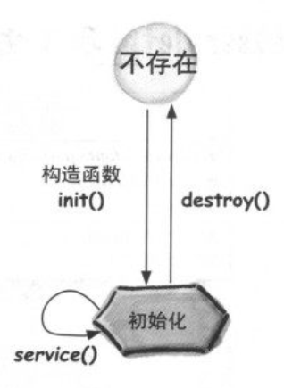
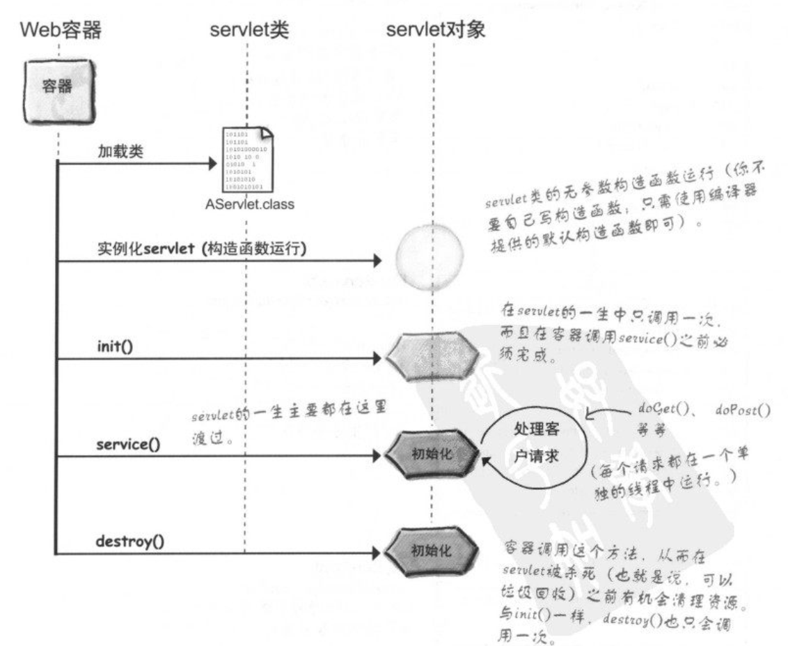
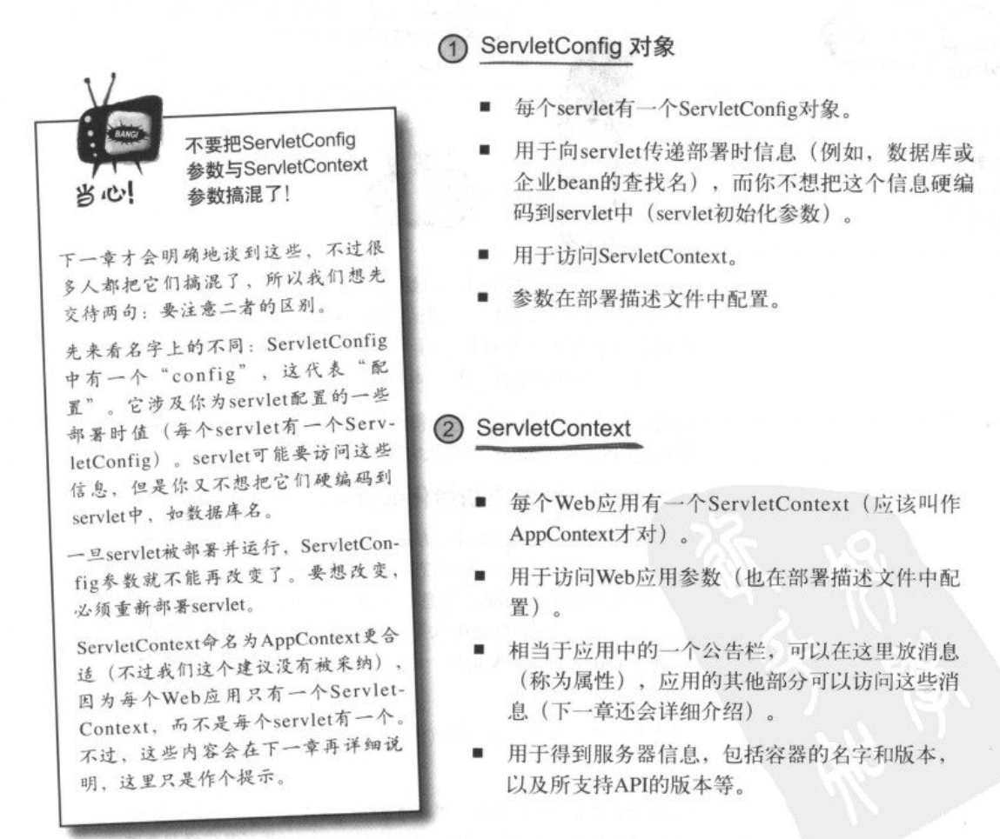
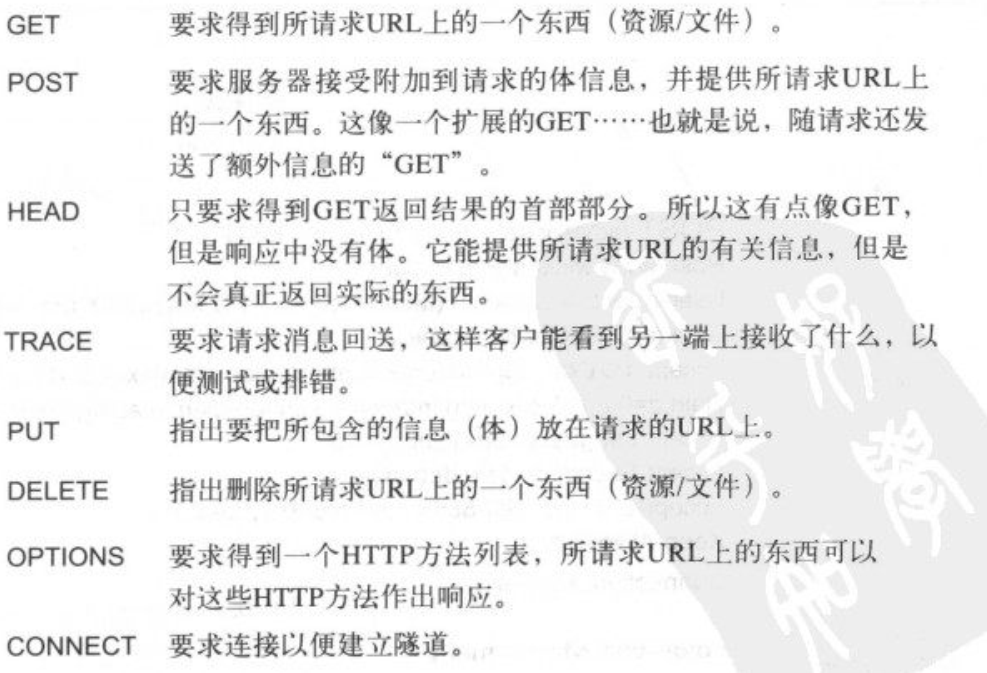
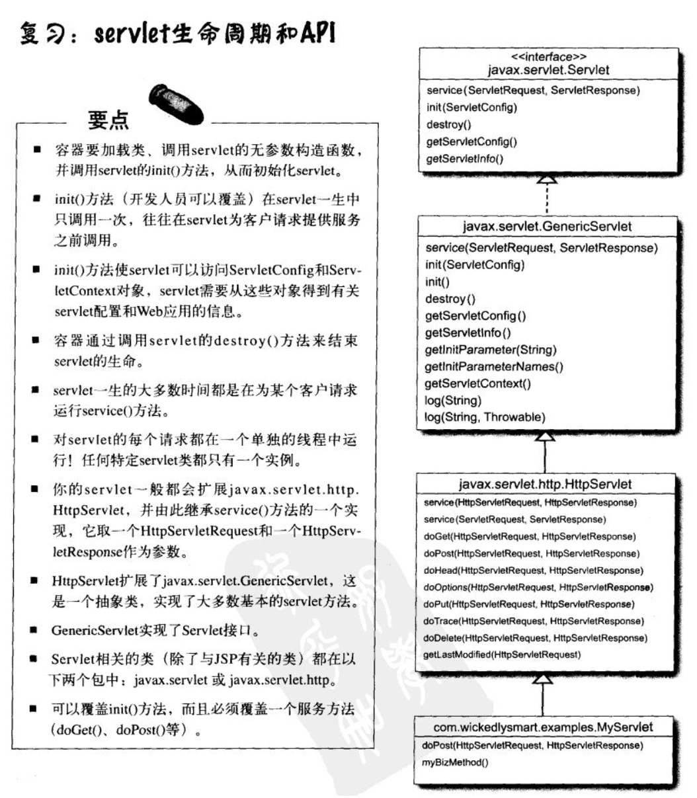
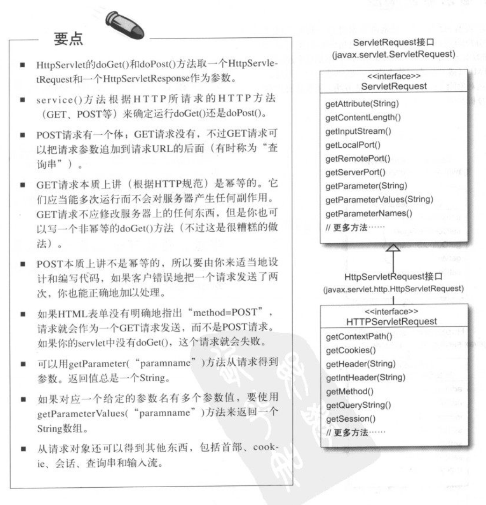
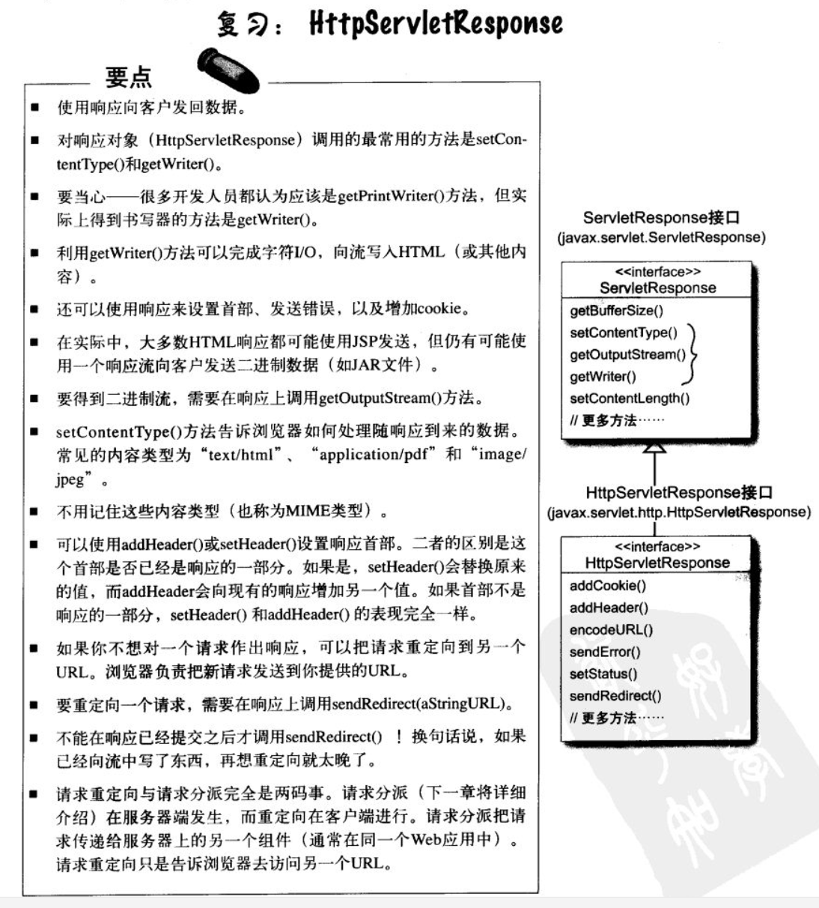

## Lifecycle

## ServletConfig and ServletContext

## HTTP 方法

## 幂等

对于HTTP/servlet，这个词表示同一个请求可以做两次，而不会对服务器产生负面作用。
我们使用“幂等”并不是说同样的请求总会得到同样的相应，也不是说一个请求没有副作用。

## servlet生命周期和API

## HTPP和HttpServletRequest

## HttpServletResponse
