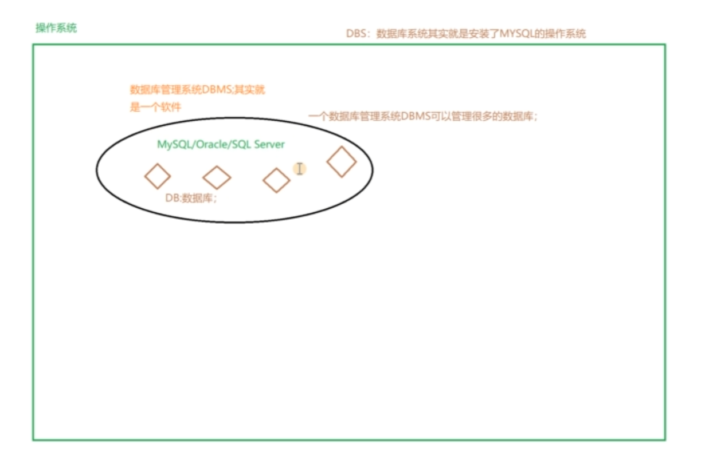

# 基础知识
## 数据库基本知识
### 1. DB, DBMS, DBS
数据库系统和数据库不是一个概念，数据库系统DBS比数据库大很多，由数据库，数据库管理系统，应用开发工具构成.
数据库，数据表，表的结构。

DB:是指datebase(数据库)数据库是存储数据的一个集合，数据库中通常使用数据表等组成，而数据表是由数据的字段和数据的值等信息组成.

DBMS:是指datebase mangement systerm(数据库管理系统)它是操作数据库和管理数据库的一个系统，比如mysq1、sqlserer等都是属于数据库管理软件，人们通过这些系统或者工具来管理数据库内的数据。

DBS:是指datebase systerm(数据库系统)

数据库系统出数据库和数据库管理软件等组成，数据库是一个逻朝上的存储数据的概念，而对应的是实体是教据库管理软件存储在硬盘上的数据库，所以数据库系统包含数据
库和数据库管理软件。

### 2. 数据库的分类
* 网状结构数据库:美国通用电气公司IDS(Integrated Data Store)以节点形式存储和访问。
* 层次结构数据库:IBM公司IMS(Information Management System)定向有序的树状结构实现存储和访问。
* 关系结构数据库:Oracle、DB2、MySQL、SQLServer，以表格(Table)存储，多表间建立关联关系，通过分类、合幷、连接、选取等运算实现访问
* 非关系型数据库:ElastecSearch、MongoDB、Redis，多数使用哈希表，表中以键值(key-value)的方式实现特定的键和一个指针指向的特定数据