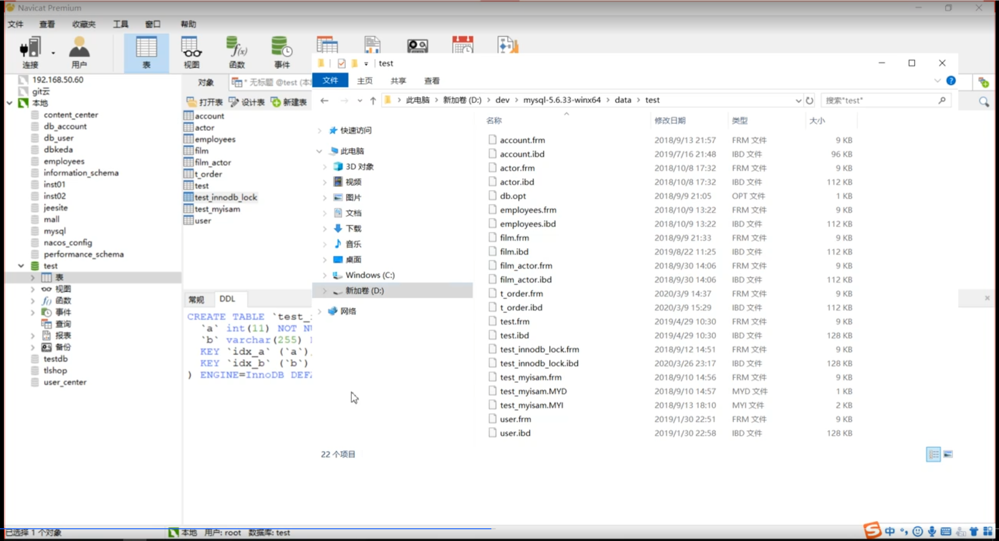
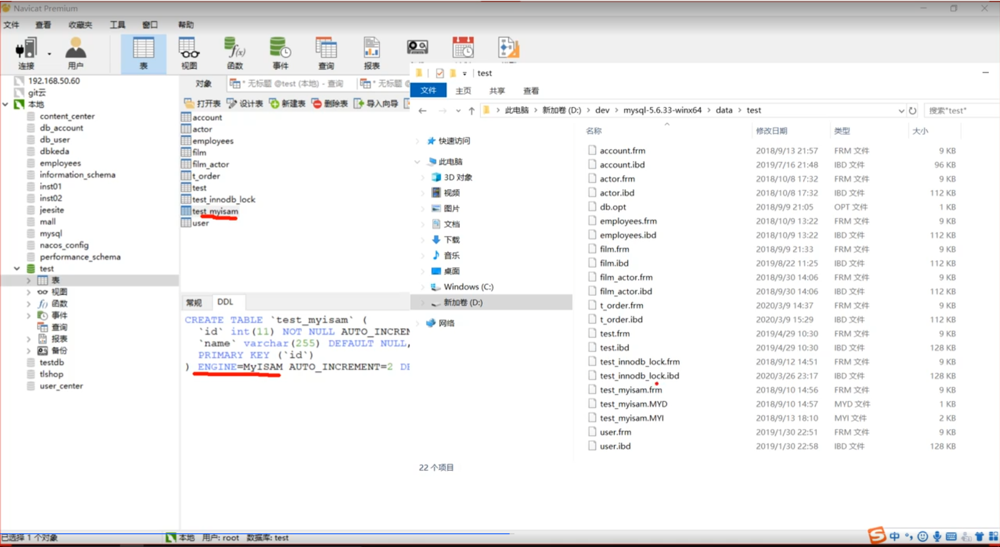
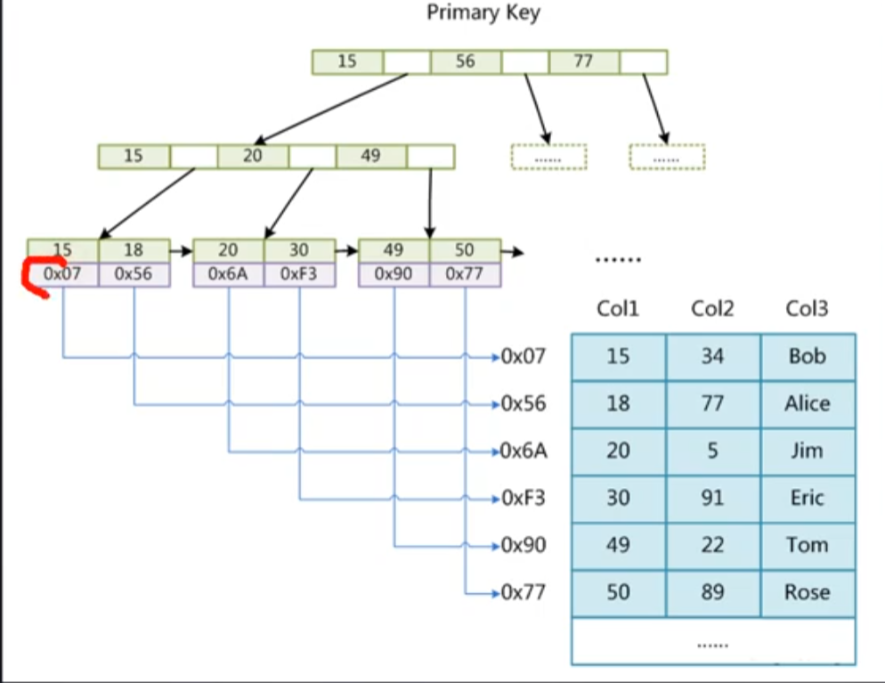
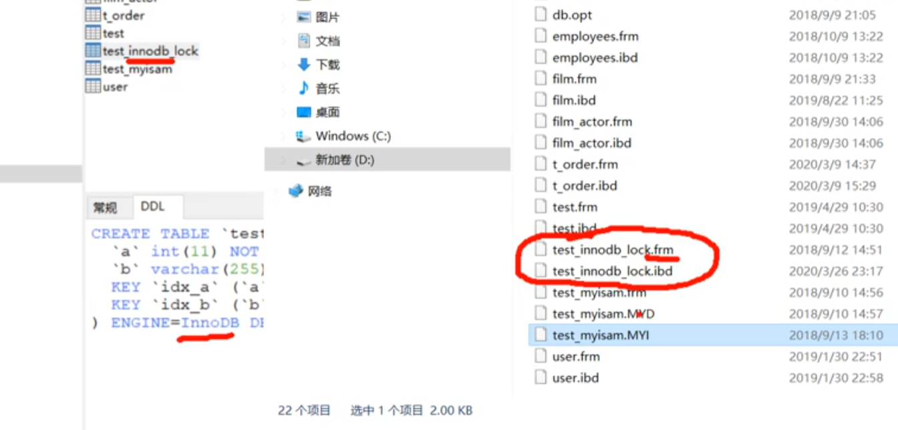
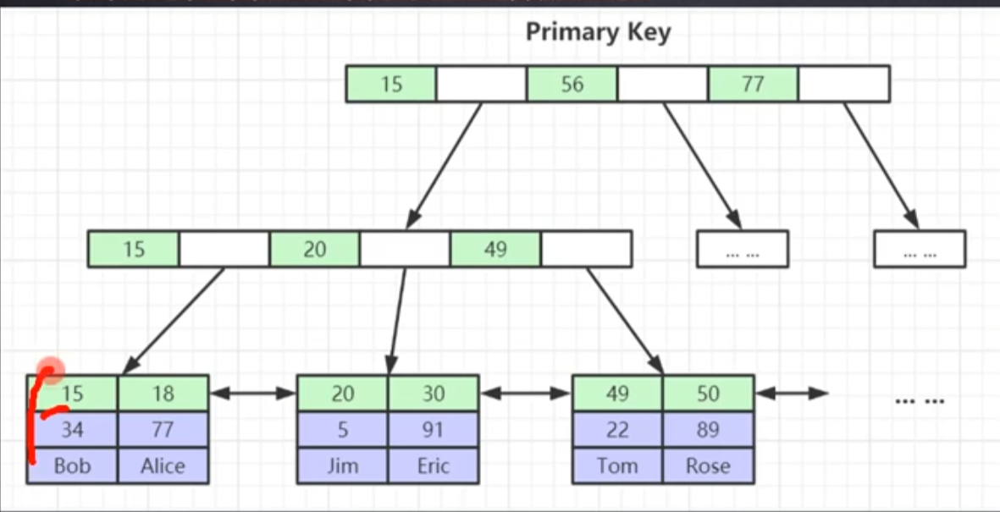
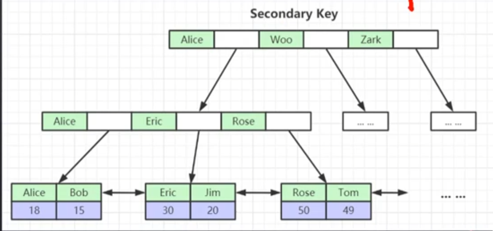
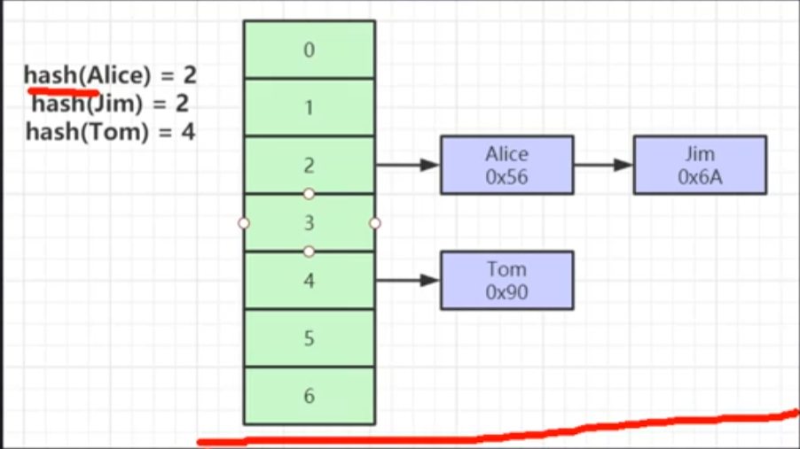
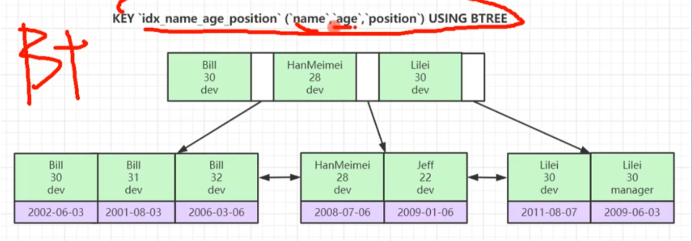

# 底层索引数据结构
* B+ 树
* 所有的索引存储在叶子节点，索引页的默认大小为16KB
* 一个索引占8个字节，地址指针大小约为6KB，16KB约可存储1170个索引，叶子节点一个月为1KB，如果整个树撑满，可以放1170 x 1170 x 16
* 根节点常驻内存

# 索引存储在哪里

# 存储引擎是在什么级别生效的
表级别 

## MyISAM

.frm存储的是表结构

.MYD存储的是数据

.MYI 存储的是索引

## InnoDB

ibd放的是数据，按照b+树组织

### 聚集索引

叶节点包含了完整的数据记录（相对应的，MyISAM就是非聚集索引，叶子节点存储的是地址）

### 为什么建议InnoDB表必须建主键，并且推荐使用整型的自增主键？
* 因为ibd文件要以B+树来组织，如果有主键，就按照主键排序
* 如果没有主键，会选择一列没有重复数据的列来组织
* 如果找不到这个没有重复的列，会维护一个隐藏的列来作为索引
* 整型比大小更快，而且占的空间更小，成本更低
* 自增：如果不是有序插入，可能会导致节点分裂和树的再平衡，也会出现冗余索引；如果有序插入，结点满了会再开一个节点

### 为什么非主键索引结构叶子节点存储的是主键值？

二级索引叶子节点放的是主键/rowid
* 一致性
* 节省存储空间
* 找到之后要回表（回一级索引按照主键查找）

### 聚集索引和非聚集索引哪个更快
聚集，因为不用跨文件去查

## 哈希索引

* 对索引的key进行一次hash计算就可以定位出数据存储的位置
* 很多时候Hash索引要比B+树索引更高效（可能就一次hash运算就找到了）
* 仅能满足“=”，“IN"，不支持范围查询（b+树能非常好地进行范围查找，索引是有序的，并且前后有指针）
* hash冲突问题

## 联合索引
多个字段共同组织成一个索引

### 索引最左前缀原理（左列原理）
按照索引键的先后顺序比较，查找的时候也要按照顺序去使用，因为索引是按照这个去排序的，直接找第二个不是排好序的