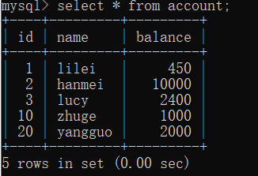

# 事务及其ACID属性
事务是由一组SQL语句组成的逻辑处理单元,事务具有以下4个属性,通常简称为事务的ACID属性。
* 原子性(Atomicity) ：事务是一个原子操作单元,其对数据的修改,要么全都执行,要么全都不执行。
* 一致性(Consistent) ：在事务开始和完成时,数据都必须保持一致状态。这意味着所有相关的数据规则都必须应用于事务的修改,以保持数据的完整性。
* 隔离性(Isolation) ：数据库系统提供一定的隔离机制,保证事务在不受外部并发操作影响的“独立”环境执行。这意味着事务处理过程中的中间状态对外部是不可见的,反之亦然。
* 持久性(Durable) ：事务完成之后,它对于数据的修改是永久性的,即使出现系统故障也能够保持。

# 并发事务处理带来的问题
## 更新丢失(Lost Update)或脏写
　　当两个或多个事务选择同一行，然后基于最初选定的值更新该行时，由于每个事务都不知道其他事务的存在，就会发生丢失更新问题–最后的更新覆盖了由其他事务所做的更新。

   不要在Java代码做操作，在sql里做。

## 脏读（Dirty Reads）
　　一个事务正在对一条记录做修改，在这个事务完成并提交前，这条记录的数据就处于不一致的状态；这时，另一个事务也来读取同一条记录，如果不加控制，第二个事务读取了这些“脏”数据，并据此作进一步的处理，就会产生未提交的数据依赖关系。这种现象被形象的叫做“脏读”。
　　一句话：事务A读取到了事务B已经修改但尚未提交的数据，还在这个数据基础上做了操作。此时，如果B事务回滚，A读取的数据无效，不符合一致性要求。
## 不可重读（Non-Repeatable Reads） 
　　一个事务在读取某些数据后的某个时间，再次读取以前读过的数据，却发现其读出的数据已经发生了改变、或某些记录已经被删除了！这种现象就叫做“不可重复读”。
　　一句话：事务A内部的相同查询语句在不同时刻读出的结果不一致，不符合隔离性
## 幻读（Phantom Reads）
　　一个事务按相同的查询条件重新读取以前检索过的数据，却发现其他事务插入了满足其查询条件的新数据，这种现象就称为“幻读”。
　　一句话：事务A读取到了事务B提交的新增数据，不符合隔离性

# 事务隔离级别

“脏读”、“不可重复读”和“幻读”,其实都是数据库读一致性问题,必须由数据库提供一定的事务隔离机制来解决。

可重复读会在transaction第一次查询的时候保留快照，之后这一次的transaction里的查询都是从快照里拿的。

| 隔离级别 | 脏读(Dirty Read) | 不可重复读(NonRepeatable Read) | 幻读(Phantom Read) |
| :----| :----| :----|:----|
|读未提交(Read uncommitted)|可能|可能|可能|
|读已提交(Read committed)|不可能|可能|可能|
|可重复读(Repeatableread)|不可能|不可能|可能|
|可串行化(Serializable)| 不可能|不可能|不可能|

数据库的事务隔离越严格,并发副作用越小,但付出的代价也就越大,因为事务隔离实质上就是使事务在一定程度上“串行化”进行,这显然与“并发”是矛盾的。

同时,不同的应用对读一致性和事务隔离程度的要求也是不同的,比如许多应用对“不可重复读"和“幻读”并不敏感,可能更关心数据并发访问的能力。

常看当前数据库的事务隔离级别: show variables like 'tx_isolation';

设置事务隔离级别：set tx_isolation='REPEATABLE-READ';

Mysql默认的事务隔离级别是可重复读，用Spring开发程序时，如果不设置隔离级别默认用Mysql设置的隔离级别，如果Spring设置了就用已经设置的隔离级别。

问题：
1. 为什么可重复读在update之后会幻读？
2. 对于串行，如果我select某一个id，其他的能更新吗 - 可以

# 锁分类
* 从性能上分为乐观锁(用版本对比来实现)和悲观锁
* 从对数据操作的粒度分，分为表锁和行锁
* 从对数据库操作的类型分，分为读锁和写锁(都属于悲观锁)，还有意向锁

## 乐观锁

假设并发操作冲突的可能性较小，因此不会主动加锁，而是进行数据版本检查来决定是否提交操作

## 悲观锁

一旦线程获得锁，其他尝试获取锁的线程都会被阻塞，直到锁被释放。常见的实现方式是数据库中的行级锁、表级锁

## 读锁（共享锁，S锁(Shared)）：

针对同一份数据，多个读操作可以同时进行而不会互相影响，比如：select * from T where id=1 lock in share mode

## 写锁（排它锁，X锁(eXclusive)）：

当前写操作没有完成前，它会阻断其他写锁和读锁，数据修改操作都会加写锁，查询也可以通过for update加写锁，比如：select * from T where id=1 for update

## 意向锁（Intention Lock）：

又称I锁，针对表锁，主要是为了提高加表锁的效率，是mysql数据库自己加的。当有事务给表的数据行加了共享锁或排他锁，同时会给表设置一个标识，代表已经有行锁了，其他事务要想对表加表锁时，就不必逐行判断有没有行锁可能跟表锁冲突了，直接读这个标识就可以确定自己该不该加表锁。特别是表中的记录很多时，逐行判断加表锁的方式效率很低。而这个标识就是意向锁。

### 意向锁主要分为：

* 意向共享锁，IS锁，对整个表加共享锁之前，需要先获取到意向共享锁。
* 意向排他锁，IX锁，对整个表加排他锁之前，需要先获取到意向排他锁。

串行化就是在mysql后台默认加读锁

## 表锁

每次操作锁住整张表。开销小，加锁快；不会出现死锁；锁定粒度大，发生锁冲突的概率最高，并发度最低；一般用在整表数据迁移的场景。

### 基本操作

#### 手动增加表锁
```lock table 表名称 read(write),表名称2 read(write);```
#### 查看表上加过的锁
```show open tables;```
#### 删除表锁
```unlock tables;```

## 页锁

只有BDB存储引擎支持页锁，页锁就是在页的粒度上进行锁定，锁定的数据资源比行锁要多，因为一个页中可以有多个行记录。当我们使用页锁的时候，会出现数据浪费的现象，但这样的浪费最多也就是一个页上的数据行。
页锁的开销介于表锁和行锁之间，会出现死锁。锁定粒度介于表锁和行锁之间，并发度一般。

## 行锁

每次操作锁住一行数据。开销大，加锁慢；会出现死锁；锁定粒度最小，发生锁冲突的概率最低，并发度最高。

### InnoDB与MYISAM的最大不同有两点：
* InnoDB支持事务（TRANSACTION）
* InnoDB支持行级锁

## 总结

InnoDB在执行查询语句SELECT时(非串行隔离级别)，不会加锁。但是update、insert、delete操作会加行锁。简而言之，就是读锁会阻塞写，但是不会阻塞读。而写锁则会把读和写都阻塞。

## 间隙锁（Gap Lock）

间隙锁，锁的就是两个值之间的空隙。Mysql默认级别是repeatable-read，有办法解决幻读问题吗？间隙锁在某些情况下可以解决幻读问题。

假设account表里数据如下：



那么间隙就有 id 为 (3,10)，(10,20)，(20,正无穷) 这三个区间。

在Session_1下面执行 update account set name = 'zhuge' where id > 8 and id <18;，则其他Session没法在这个范围所包含的所有行记录(包括间隙行记录)以及行记录所在的间隙里插入或修改任何数据，即id在(3,20]区间都无法修改数据，注意最后那个20也是包含在内的。

间隙锁是在可重复读隔离级别下才会生效。

## 临键锁(Next-key Locks)

Next-Key Locks是行锁与间隙锁的组合。像上面那个例子里的这个(3,20]的整个区间可以叫做临键锁。

## 无索引行锁会升级为表锁(RR级别会升级为表锁，RC级别不会升级为表锁)

锁主要是加在索引上，如果对非索引字段更新，行锁可能会变表锁

session1 执行：update account set balance = 800 where name = 'lilei';

session2 对该表任一行操作都会阻塞住

InnoDB的行锁是针对索引加的锁，不是针对记录加的锁。并且该索引不能失效，否则都会从行锁升级为表锁。

### 结论
Innodb存储引擎由于实现了行级锁定，虽然在锁定机制的实现方面所带来的性能损耗可能比表级锁定会要更高一下，但是在整体并发处理能力方面要远远优于MYISAM的表级锁定的。当系统并发量高的时候，Innodb的整体性能和MYISAM相比就会有比较明显的优势了。

但是，Innodb的行级锁定同样也有其脆弱的一面，当我们使用不当的时候，可能会让Innodb的整体性能表现不仅不能比MYISAM高，甚至可能会更差。


# MVCC

MVCC(multi-version concurrency control)机制，select操作不会更新版本号，是快照读（历史版本）；insert、update和delete会更新版本号，是当前读（当前版本）。

# 大事务的影响

* 并发情况下，数据库连接池容易被撑爆
* 锁定太多的数据，造成大量的阻塞和锁超时
* 执行时间长，容易造成主从延迟
* 回滚所需要的时间比较长
* undo log膨胀
* 容易导致死锁

## 事务优化实践原则

* 将查询等数据准备操作放到事务外
* 事务中避免远程调用，远程调用要设置超时，防止事务等待时间太久
* 事务中避免一次性处理太多数据，可以拆分成多个事务分次处理
* 更新等涉及加锁的操作尽可能放在事务靠后的位置
* 能异步处理的尽量异步处理
* 应用侧（业务代码）保证数据一致性，非事务执行（用try catch做回滚）（也就是不用事务，在性能要求非常高的时候）

## 锁优化建议

* 尽可能让所有数据检索都通过索引来完成，避免无索引行锁升级为表锁
* 合理设计索引，尽量缩小锁的范围
* 尽可能减少检索条件范围，避免间隙锁
* 尽量控制事务大小，减少锁定资源量和时间长度，涉及事务加锁的sql尽量放在事务最后执行
* 尽可能低级别事务隔离
