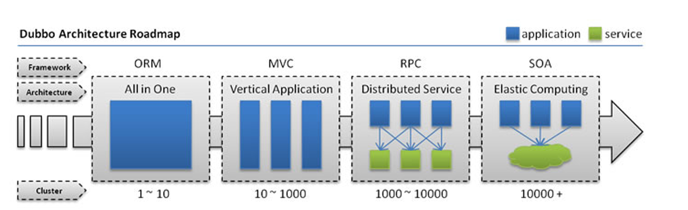
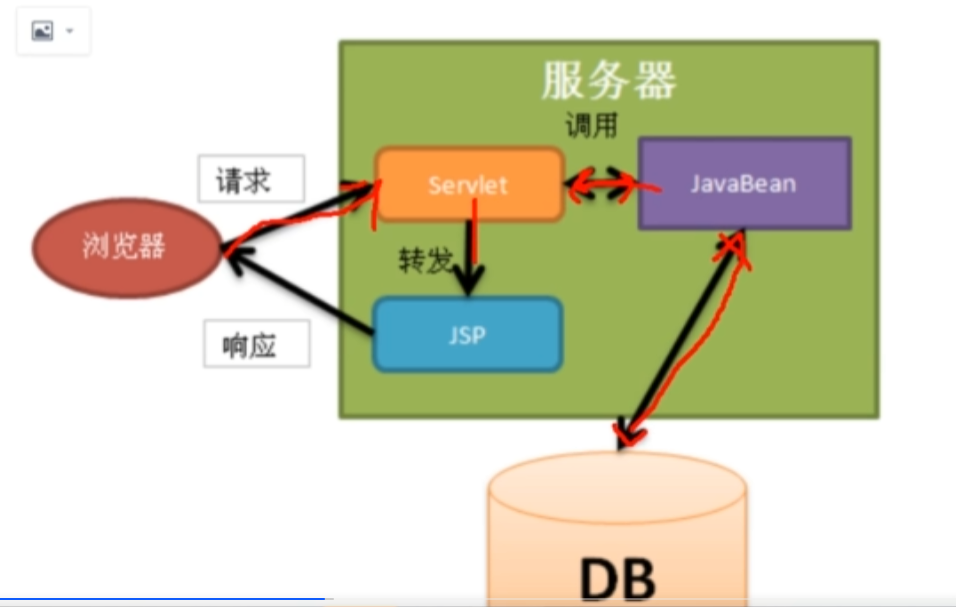
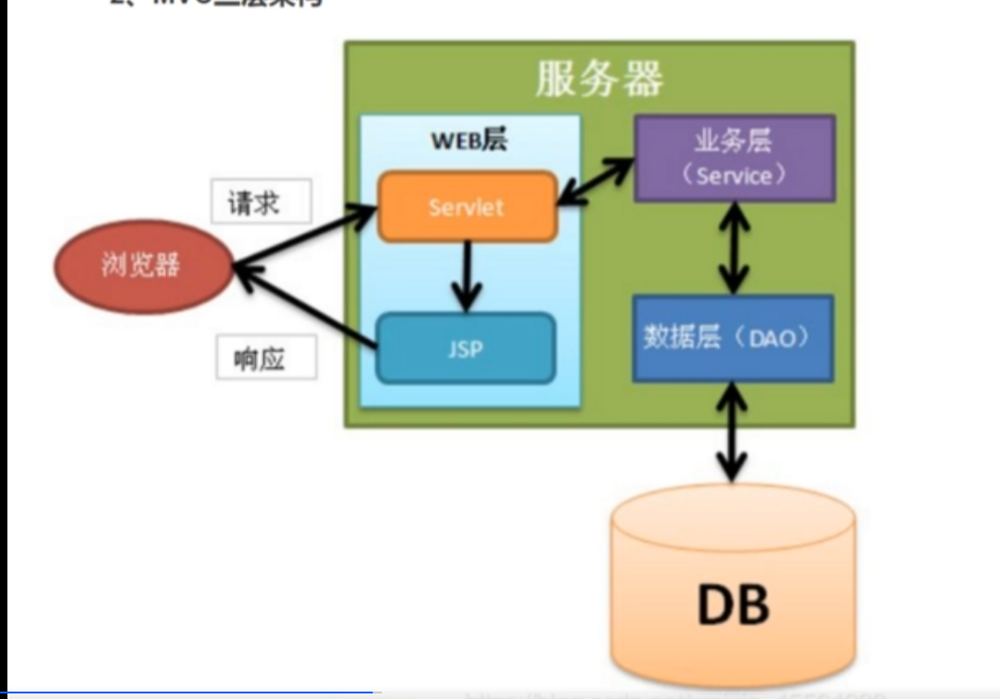
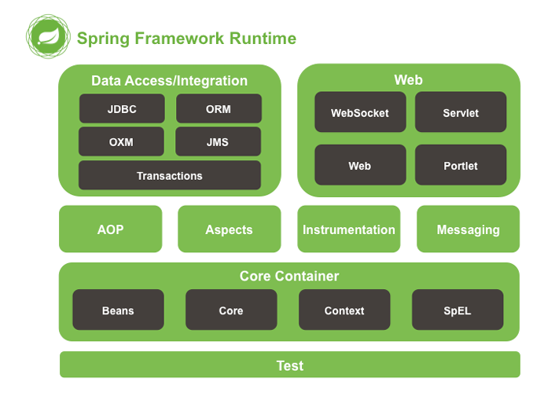
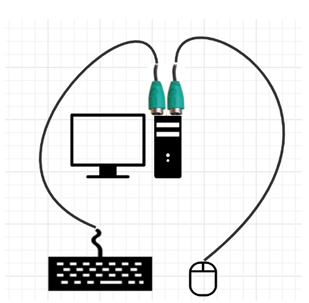
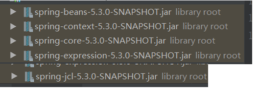

# 历史



### 单一应用架构

当网站流量很小时，只需一个应用，将所有功能都部署在一起，以减少部署节点和成本，此时，用于简化增删改查工作量的数据访问框架（ORM）是关键

### 垂直应用架构

当访问量逐渐增大，单一应用增加机器带来的加速度越来越小，提升效率的方法之一是将应用拆成互不相干的几个应用，以提升效率。此时，用于加速前端页面开发的Web框架（MVC）是关键

### 分布式服务架构

当垂直应用越来越多，应用之间交互不可避免，将核心业务抽取出来，作为独立的服务，逐渐形成稳定的服务中心，使前端应用能更快速地相应多变的市场需求。此时用于提高业务复用及整合的分布式服务框架RPC是关键

### 流动计算架构

当服务越来越多，容量的评估，小服务资源的浪费等问题逐渐显现，此时需增加一个调度中心基于访问压力实施管理集群容量，提高集群利用率。此时用于提高机器利用率的资源调度和治理中心（SOA）是关键

# Java主流架构技术演变之路

### 1、Servlet+JSP+JavaBean



### 2、MVC三层架构



Model Controller View

Web层接受请求，组成Model传给业务层，DAO 访问数据库，JSP返回给浏览器

### 3、 EJB 

但是EJB是重量级框架（在使用的时候，过多的接口和依赖，侵入性强）在使用上比较麻烦

什么是侵入性比较强的，就是如果我要使用某一个功能，必须继承类，必须实现某一个接口，总的来说比较麻烦

### 4、 Struts/Struts2 + Hibernate + Spring（SSH）

### 5、Spring MVC + Mybatis + Spring

Mybatis比Hibernate更灵活

### 6、SpringBoot开发，约定大于配置

# Spring

### 什么是Spring

SpringshiyigeqingliangjiJava开发框架，目的是为了解决企业级应用开发的业务逻辑层和其他各层的耦合问题。
它是一个分层的JavaSE/Java EEfull-stack（一站式）轻量级开源框架，为开发Java应用程序提供全面的基础架构支持。
Spring负责基础架构，因此Java开发者可以专注于应用程序的开发。
Spring最根本的使命是解决企业级应用开发的复杂性。即简化Java开发
Spring可以做很多事情，它为企业级开发提供了丰富的功能，但是这些功能的底层都依赖于他的两个核心特性——依赖注入（dependency injection DI IOC）和面向切面编程（aspect-oriented programming AOP)

#### 简略核心解释

spring是一个轻量级的开源框架。

spring是维克解决企业级应用开发的业务逻辑层和其他各层的耦合问题。

spring是一个IOC和AOP的容器框架

    IOC：控制反转（依赖注入）

    AOP：面向切面编程

    容器：包含并管理应用对象的生命周期（管理创建，加载，销毁）

### 模块划分



Test:Spring的单元测试模块

Core Container:核心容器模块

AOP+Aspects:面向切面编程模块

Instrumentation:提供了class instrumentation支持和类加载器的实现来在特定的应用服务器上使用,几乎
不用

Messaging:包括一系列的用来映射消息到方法的注解,几乎不用

Data Access/Integration:数据的获取/整合模块，包括了JDBC,ORM,OXM,JMS和事务模块

Web:提供面向web整合特性

# IOC（Inversion of Control)控制反转

## 基本概念

IOC是一种设计思想，在Java开发中，将你设计好的对象交给容器控制，而不是显示地用代码进行对象的创建。 

把创建和查找依赖对象的控制权交给 IoC 容器，由 IoC 容器进行注入、组合对象之间的关系。
这样对象与对象之间是松耦合、功能可复用（减少对象的创建和内存消耗），使得程序的整个体系结构可维护性、灵活性、扩展性变高。
所谓IOC ，就简短一句话：对象由spring来创建、管理，装配！

## 面向对象编程原则
如果把鼠标焊在主板上，那肯定不行，相当于是
```xxxService = new xxxService()```

### 1. 接口分离原则ISP(the Interface Segregation Principle ISP)
模块间要通过抽象接口隔离开，而不是通过具体的类强耦合起来

不要将鼠标（具体实现）直接焊在主板上，使用插口（抽象）连接；


```java
interface xxxService
class xxxServiceImpl
xxxService service = new xxxServiceImpl
```

现在接口有了，但是无法热插拔。 每次鼠标坏了需要关掉电脑才能更换（实现类换了还是需要去变更代码）

###  2、依赖倒置原则DIP(the Dependency Inversion Principle DIP)

具体实现依赖抽象，下层依赖上层。    分离

依赖倒置原则使鼠标、键盘和电脑成为独立的的互不相干的对象，当电脑（上
层）没有鼠标可以正常启动但是鼠标（下层）没有电脑则一无是处 ，控制权就
被反转了（IOC）。 所以鼠标需要依赖USB（DI）才能使用。

之前——正转: 主板焊接>鼠标    电脑没有鼠标则无法启动    

现在——反转: 电脑<依赖鼠标     引入DI可以实现IOC

IOC是DIP的设计原理，DI是IOC的具体实现

鼠标坏了很快就可以换一个，虽然会涉及短暂无法使用， 但是产生的变更极少。

IUserDao dao=从ioc中获取     涉及到的代码变更极少

## IOC代码实现

### 导入jar包--配置xml    

入门  搭建基于ioc的spring

#### 1. 导入jar包

访问：spring仓库https://repo.spring.io/list/libs-snapshot
local/org/springframework/spring/

下载任意版本的spring

只需要下载dist.zip    -  包含了docs    schema



```xml
 <?xml version="1.0" encoding="UTF‐8"?>

<beans xmlns="http://www.springframework.org/schema/beans"
 xmlns:xsi="http://www.w3.org/2001/XMLSchema‐instance"
 
xsi:schemaLocation="http://www.springframework.org/schema/beans http://w
 ww.springframework.org/schema/beans/spring‐beans.xsd">

 
<bean class="cn.tulingxueyuan.dao.UserDao" id="userDao"></bean>

 <bean class="cn.tulingxueyuan.service.UserService" id="userService">
 <property name="dao" ref="userDao"></property>
 </bean>
 </beans>
```

# 总结

很多人把IOC和DI说成一个东西，笼统来说的话是没有问题的，但是本质上还是有所区别的,希望大家能够
严谨一点，IOC和DI是从不同的角度描述的同一件事，IOC是从容器的角度描述，而DI是从应用程序的角度
来描述，也可以这样说，IOC是依赖倒置原则的设计思想，而DI是具体的实现方式