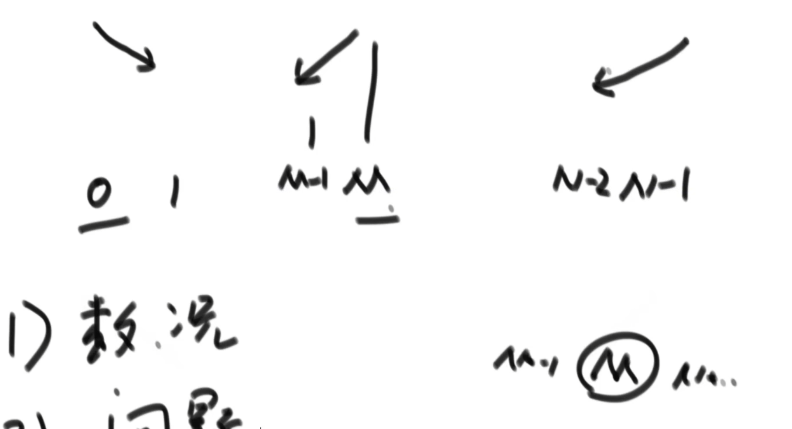

# 时间复杂度
只要高阶项，不要低阶项，也不要高阶项的系数，剩下的部分如果为f(N)，那么时间复杂度为O(f(N))

# 排序算法

## 冒泡排序

## 冒泡排序

## 插入排序

时间复杂度O(N) ~ O(N^2)
与数据状况有关

## 位运算

提取出最右侧的1：
int rightOne = eor & (~eor + 1)

## 二分 
### 在一个有序数组中找某个数是否存在
O(log 2 N)
### 在一个有序数组中找到 >= 某一个数最左侧的位置

### 局部最小值 
arr中，无序，任意相邻数不相等
