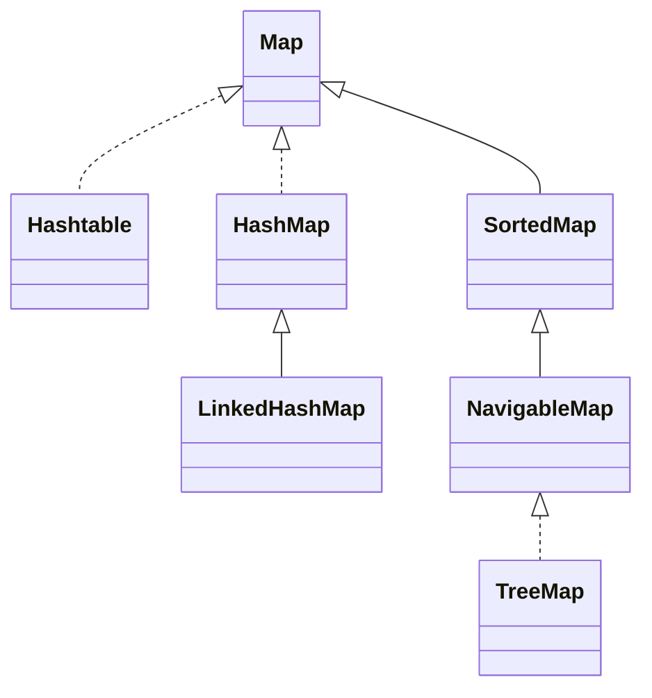

# Map接口实现


## HashMap、Hashtable、和ConcurrentHashMap

| 类别        | HashMap           | LinkedHashMap     | TreeMap      | Hashtable |
|:----------|:------------------|:------------------|:-------------|:----------|
| 实现方式      | 哈希表               | 哈希表               | 红黑树          | 哈希表       |
| 有序性       | 无序                | 按照插入顺序            | Comparator排序 | 无序        |
| null值     | 最多一个null键，多个null值 | 最多一个null键，多个null值 | 不允许存null     | 不允许空键或空值  |
| 重复键       | 不支持               | 不支持               | 支持           | 不支持       |
| 线程安全      | 不安全               | 不安全               | 不安全          | 安全        |线程安全|线程安全|
| fail-fast | 是                 | 是                 | 是            | 不是        |

fail-fast：迭代器被创建之后，发生任何修改都会导致ConcurrentModificationException（CME）

| ConcurrentHashMap                  | SynchronizedMap                  | Hashtable                        |
|:-----------------------------------|:---------------------------------|:---------------------------------|
| 线程安全，无需锁定整个哈希表，只需要一个桶级锁            | 线程安全，锁定整个Map对象                   | 线程安全，锁定整个Map对象                   |
| 同时允许多个线程安全地操作Map对象                 | 一次只允许一个线程对一个Map对象执行操作            | 一次只允许一个线程对一个Map对象执行操作            |
| 读操作可以不加锁                           | 读和写操作都需要加锁                       | 读和写操作都需要加锁                       |
| 当一个线程迭代Map对象时，另一个线程被允许修改，并且不会得到CME | 当一个线程迭代Map对象时，其他线程不允许修改，否则会得到CME | 当一个线程迭代Map对象时，其他线程不允许修改，否则会得到CME |
| 键和值都不允许为空                          | 键和值都允许为空                         | 键和值都不允许为空                        |
| 在Java 1.5中引入                       | 在Hava 1.2中引入                     | 在Java 1.0中引入                     |

## HashMap
### 数据结构
jdk 1.8之前使用数组+链表，JDK1.8引用红黑树，当链表长度太长时，链表转换为红黑树
### 扩容机制
#### size和capacity
* size：记录Map中K-V对的个数
* capacity：容量，如果不指定，默认容量是**16**
  * 这个值应该是个经验值( Experience Value)，既然一定要设置一个默认的2的n次方作为初始值，那么就需要在效率和内存使用上做一个权衡。这个值既不能太小，也不能太大。太小了就有可能频繁发生扩容，影响效率。太大了又浪费空间，不划算。所以，16 就作为一个经验值被采用了。 
#### loadFactor和threshold
* loadFactor: 负载因子，用来衡量HashMap”满“的程度。默认0.75f
  * 大概意思是: 一般来说，默认的负载因子(0.75)在时间和空间成本之间提供了很好的权衡。更高的值减少了空间开销，但增加了查找成本(反映在HashMap类的大多数操作中，包括 get和put)
* threshold: 临界值，当实际K-V个数超过threshold，HashMap会将容量扩容，threshold = 容量 * 负载因子
#### 扩容与Hash碰撞
在合适的时候（当实际K-V个数超过threshold）扩大数组容量（resize），再通过一个合适的Hash算法将元素分配到这个数值中(rehash)，既可以大大减少元素碰撞的概率，也可以避免查询效率低下的问题。

扩容后的Table容量变为原来的两倍

### HashMap不是线程安全的
HashMap在并发情况下，会因为扩容而导致死循环现象。在JDK 1.8之前的版本中，HashMap是采用头插法进行扩容，1.8已经修复，但仍然不适用于并发场景，在并发情况下可能出现丢数据等情况。
### 不能在foreach循环里对集合中的元素进行remove/add操作
我们使用的增强for循环，其实是Java提供的语法糖，其实现原理是借助Iterator进行元素的遍历。

如果在遍历过程中，不通过Iterator，而是通过集合类自身的方法对集合进行添加/删除操作，在Iterator进行下一次的遍历时，经检测发现有一次集合的修改操作并未通过自身进行，则可能发生了并发，而被其他线程执行，这时就会抛出异常，提示用户可能发生了并发修改，这就是所谓的fail-fast机制。

可以这么做：
1. 直接使用普通for循环进行操作: remove操作会改变List中元素的下标，可能存在漏删的情况
2. 直接使用Iterator提供的remove方法
```java
while(iterator.hasNext()) {
    if(iterator.next().equals("xxx")) {
        iterator.remove();
    }
}
```
3. 使用Java 8中提供的filter
```java
list.stream().filter(v -> !v.equals("xxx")).collect(Collectors.toList()); 
```

### 红黑树
因为HashMap采用的是数组+链表的结构，当链表长度过长时，会存在性能问题。所以，在JDK 1.8中引人了红黑树。
但不是说直接就把数据结构替换成了红黑树，而是在满足一定条件时（当前链表长度大于TREEIFY_THRESHOLD)，数据结构才会转成红黑树

TREEIFY_THRESHOLD 表示从链表转换成红黑树的阈值，当链表中的节点数量大于或等于这个值时，链表就会转换成红黑树。

UNTREEIFY_THRESHOLD 表示从红黑树退化成链表的阈值，当链表中法人节点数量小于或等于这个值时，红黑树就会转换成链表。

MINTREEIFY_CAPACITY表示从链表转换成红黑树时，容器的最小容量的阈值。只有当容量大于这个数并且链表长度大于或等于TREEIFY_THRESHOLD 时，才会转换成红黑树。