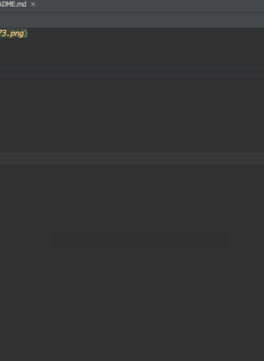
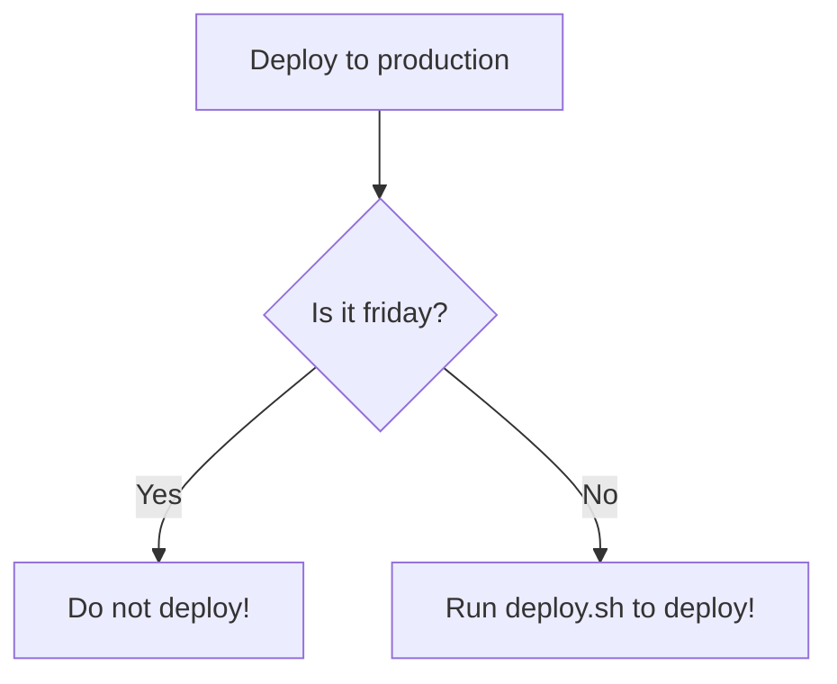

This is an H1
=============

This is an H2
-------------

# this is H1

## this is H2

###### this is H6

normal text

**Bold**

*italic*

***Bold and italic***

~~delete~~

---

> 引用
>
>> 嵌套引用
>>

* 列表内容
* 圆点列表

1. 有序列表
2. 第二

* 列表可以嵌套
  * 只需要在前面打三个空格

1. 有序列表也可以

   1. 也是三个空格
2. 列表可以包含多个段落

   每个项目下的段落都必须缩进四个空格或是一个制表符

   > 如果列表里有引用，也要缩进
   >

还可以有表格


| 左对齐 | 居中 | 右对齐 |
|:----| :----: | -------: |
| 内容  | 内容 |   内容 |

那么如何插入代码呢

缩进制表符即可

    System.out.println("Hello World!");
或者使用单行代码

这里有一句代码`code`

或者插入一段代码

```java
public class SimpleGui1 implements ActionListener {
    JButton button;
}
```

<font face="黑体">我是黑体字</font>

<font face="微软雅黑">我是微软雅黑</font>

<font color=red>我是红色</font>

<font color=#008000>我是绿色</font>

<font color=Blue>我是蓝色</font>

<font face="微软雅黑" color=C5C5C5>我是灰色</font>

<font face="微软雅黑" color=7D7D7D>我是深灰色</font>

<font face="微软雅黑" color=808C6C>我是绿色</font>

<font size=5>我是尺寸</font>

<font face="黑体" color=green size=5>我是黑体，绿色，尺寸为5</font>

<center>居中</center>
<p align="left">左对齐</p>
<p align="right">右对齐</p>

H<sub>2</sub>O  CO<sub>2</sub>
爆米<sup>TM</sup>

**超链接**

This is [an example](http://www.google.com/ "Optional Title Here") inline link.

**参考式链接**

This is [an example][1] reference-style link.

**自动链接**

[http://google/com/](http://google/com/)

**插入图片**




- [ ]  **Cmd Markdown 开发**
  - [ ]  改进 Cmd 渲染算法，使用局部渲染技术提高渲染效率
  - [ ]  支持以 PDF 格式导出文稿
  - [X]  新增Todo列表功能 [语法参考](https://github.com/blog/1375-task-lists-in-gfm-issues-pulls-comments)
  - [X]  改进 LaTex 功能
    - [X]  修复 LaTex 公式渲染问题
    - [X]  新增 LaTex 公式编号功能 [语法参考](http://docs.mathjax.org/en/latest/tex.html#tex-eq-numbers)
- [ ]  **七月旅行准备**
  - [ ]  准备邮轮上需要携带的物品
  - [ ]  浏览日本免税店的物品
  - [X]  购买蓝宝石公主号七月一日的船票

## 流程图




## 更多绘图

[https://support.typora.io/Draw-Diagrams-With-Markdown/#sequence-diagrams](https://support.typora.io/Draw-Diagrams-With-Markdown/#sequence-diagrams)

[1]: http://google.com
