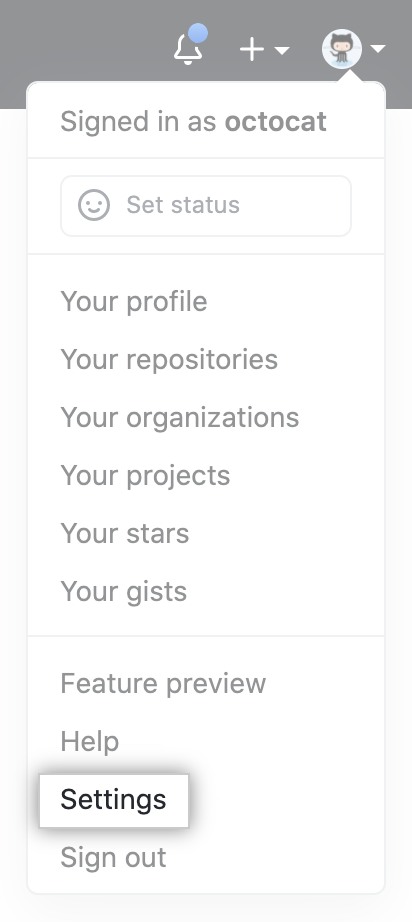

#基础设置
## 设置用户名 邮件地址

###1. 为计算机上的每个仓库设置git用户名
```shell
git config --global user.name "xxx"
```

###2. 为一个仓库设置用户名

将当前工作目录更改为本地仓库的目录

```shell
git config user.name "xxx"
```

###3. 在GitHub上设置提交电子邮件地址



In the "Access" section of the sidebar, click  Emails.


###4. 在Git中设置提交电子邮件地址

```shell
git config --global user.email "xxx@xxx.com"
```

为一个仓库设置电子邮件地址同上面设置用户名

###5. clone
```shell
git clone git clone https://github.com/MeredithAli/github-slideshow.git
```
###6. 创建和推送更改
```shell
git add .
git commit -m "message"
git push
```
###7. 词汇表

[https://docs.github.com/cn/get-started/quickstart/github-glossary] 

###8. 基本命令

####8.1 配置工具

对所有本地仓库的用户信息进行配置

`git config --global user.name "[name]"`

对你的commit操作设置关联的邮箱地址

`git config --global user.email "[email address]"`

启用有帮助的彩色命令行输出

`git config --global color.ui auto`

####8.2 分支

